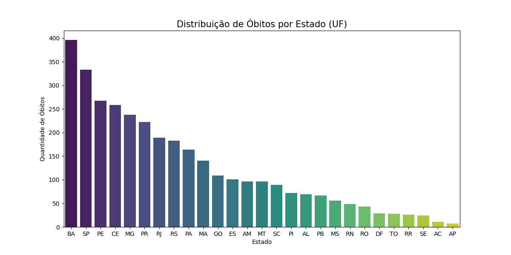
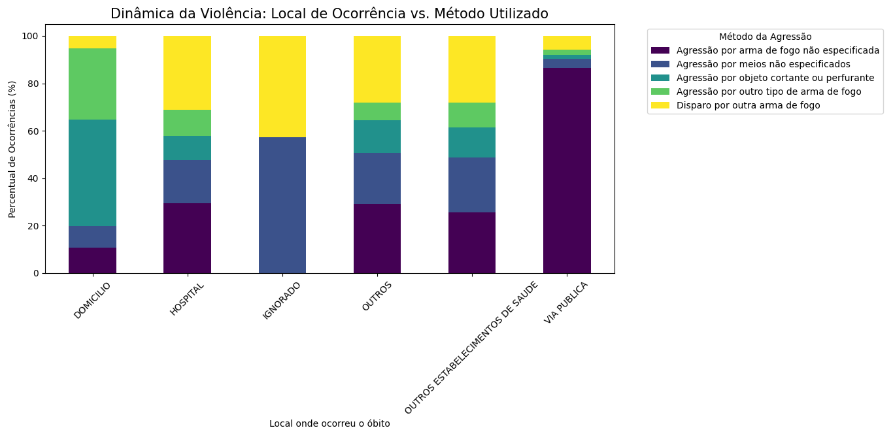

## Sobre o Projeto ##
Este repositório contém uma análise estatística detalhada sobre os casos de feminicídio registrados no Brasil entre os anos de 2009 e 2013. O objetivo principal é identificar padrões, áreas críticas e métodos mais comuns, utilizando dados oficiais para fornecer uma visão clara da violência de gênero no período.

## Principais Insights ##
A análise destaca pontos cruciais que ajudam a entender o cenário da época:
* Ranking por Estado: Identificação das unidades federativas com números alarmantes.
* Locais das Ocorrências: Onde a violência mais acontece (perfil do ambiente).
* Métodos Utilizados: Tipificação dos instrumentos usados nos feminicídios.

## Exemplos de Visualizações ##
Aqui estão alguns dos gráficos gerados pela análise:

### Distribuição por Estado

### Relação entre Local e Método

## Tecnologias e Ferramentas: ##
* Linguagem: Python (ou R, conforme você usou).
* Bibliotecas: Pandas, Matplotlib, Seaborn (para os gráficos).
* Fonte de Dados: IBGE 
